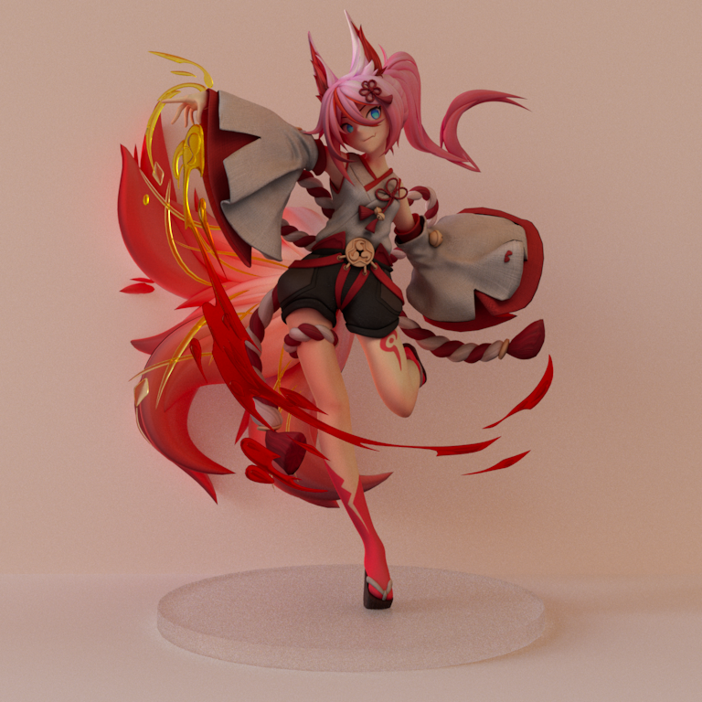
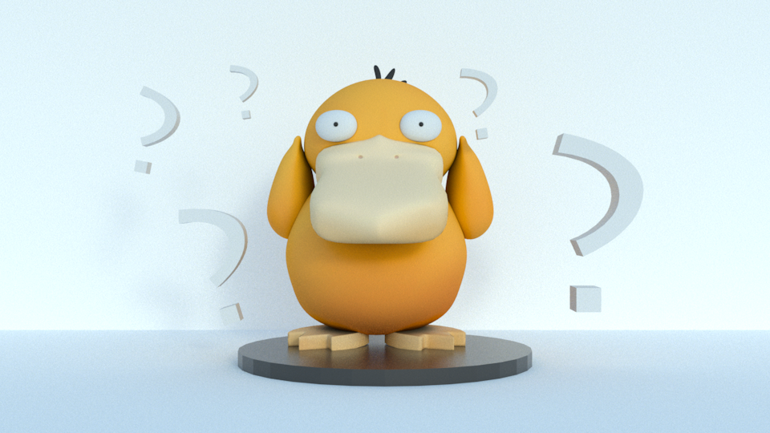

# mitsuba examples scenes

all scenes come from web, mainly [sketchfab](https://sketchfab.com/), exported with blender and rendered with [mitsuba 2](https://github.com/mitsuba-renderer/mitsuba2)

some showcase here

## higokumaru

[model link]:https://sketchfab.com/3d-models/higokumaru-honkai-impact-3rd-0e903387170846f5939adaa0c277b91b

the texture of the model has light effect (self shadows) on it, so when rendered again this will appear a little dark, especially the white cloth, or maybe there is something wrong with the light settings. 

## psyduck

[model link]: https://sketchfab.com/3d-models/psyduck-6bd718edee504a26922000c546a455a9

confused psyduck, just like me when looking at mitsuba2's code

 All scenes are licensed under a <a rel="license" href="http://creativecommons.org/licenses/by-nc/4.0/">Creative Commons Attribution-NonCommercial 4.0 International License</a>.
